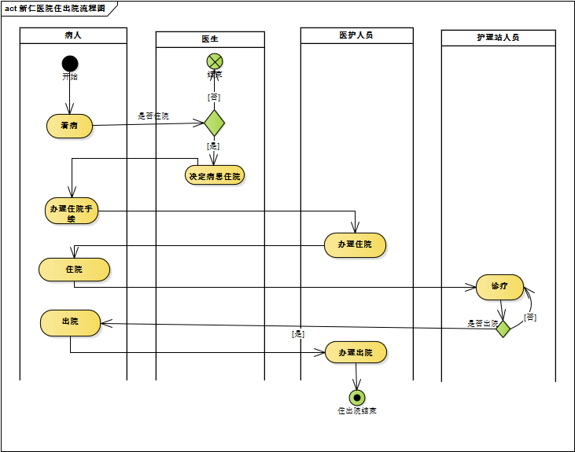
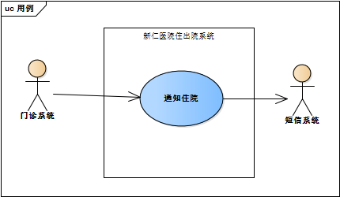
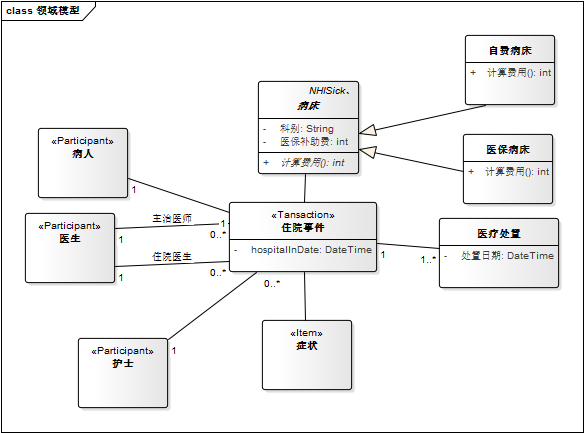

# 活动图练习

# 用例图

> 主要是从业务流程中找到对企业业务流程有用的功能，找到相关的人员，和他们
沟通，收集需求。这就是用例。

+ 用例

> 用例其实就是想捕捉用户对于系统的期望；对于需求的描述，主要描述用户通过这个功能想达到什么目的。

+ Ivar Jacobson 对于用例的定义

> 用例是在一个系统中所进行的一连串的处置活动，该活动主要是要能够满足系统外部的执行者对于系统的某种预期。

每一个系统用例都代表了用户对于系统的一个“完整的期望”

+ 用例中的主要的概念

> - 用例
> - 执行者
> - 边界
> - 关联

 > 在系统之外的辅助系统，只能是系统的辅助系统，当然包括人肉系统

 用例是需求收集和整理的工具；

 一个完整的用例包括用例图和用例叙述；

 通过执行者和用例的关系，让分析人员将注意力集中到某个主题上（用例）

 系统用例的辅助者和系统同级

 #  类图

 系统的静态结构

概念模型
问题域在抽象层次的表达就是概念模型
用抽象的方法标示问题域的核心内容

> 问题域中的 人、事、时、地、物就是概念

